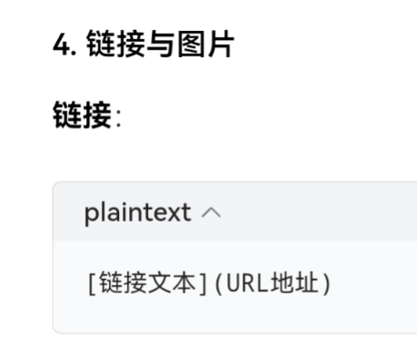

# 列表（最大，一级标题）
###### 最小，六级标题

## 现在要做一个有序列表（二级标题）
1. 第一个
2. 第二个
3. 这个也是输完数字之后也要加空格哦😲
## 接下来这个是无序列表哦，
有三种表达方式，实现的效果是一样的
- 第一种
* 第二种
+ 第三种

# 文本样式
我要试试这些文本样式啦
- **这个是粗体**
- *一个星号是斜体*
- ***这个是粗斜体***
- ~~这个是删除线~~，
- 预览看看效果,这里要注意使用英文状态下的~

# 链接与图片

## **链接**🔗
- [豆包生成的markdown基本语法知识链接](https://www.doubao.com/chat/31242896317906434)
- [✍给该链接的起名](放进去链接即可)

## 图片
太奇怪了，无法在谷歌浏览器中上传成功图片，显示为暂无可打开方式，最终试了一下微软edge浏览器，成功把截图放进仓库里了

### 这里我来解释一下如何上传图片到该文档中
#### 方法一
* 首先将你想放进该文档中的图片放到仓库中，就是上传图片
* 紧接着其实就是在code里做引用操作，之后才在preview看到效果
* 引用操作的语法：

#### 方法二
相对引用
* ![超链接语法结构截图]（images/chao lian jie 语法结构.png）
* 
* 这里终于相对引用图片成功了，就是图片命名的时候不要有空格，我加了小横线之后就可以了，上边的那个一直不成功

#### 语法含义解释
* !：感叹号开头，表示这是一个图片
* [替代文本]：当图片无法显示时显示的文字说明，必填，我理解的就是为图片起名字，实操中只需要有英文状态下的中括号就可以了，在中括号里头填内容，至于中括号旁边有个点点是自动出现的，我不清楚它为什么在
* (图片路径)：本地图片的路径（绝对或相对），必填，这里就是上传链接，把上传进仓库的图片打开，复制链接，放到这里即可，我这里描述的是绝对引用
* "可选标题"：鼠标悬停时显示的标题，可选
